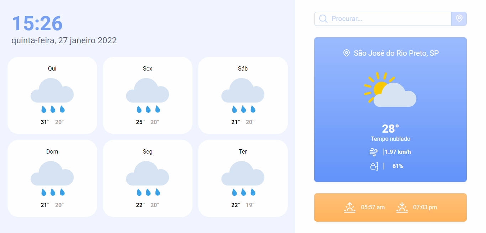

<p align="center">
 
</p>



## 🚀 Tecnologias

Esse projeto foi desenvolvido com as seguintes tecnologias:

- [React](https://pt-br.reactjs.org/)
- [Next](https://nextjs.org/)
- [Styled-components](https://styled-components.com/)
- [TypeScript](https://www.typescriptlang.org/)


## 🧪 Como executar

Clone o projeto e acesse a pasta do mesmo.

```bash
$ git clone https://github.com/Aldovani/next-weather

$ cd next-weather
```

Para iniciá-lo, siga os passos abaixo:
```bash
# Instalar as dependências com yarn
$ yarn 

# Iniciar o projeto
$ yarn dev
```

O app estará disponível no seu browser pelo endereço http://localhost:3000.


